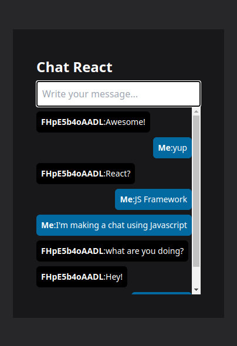

# Social Chat Application

IP Geolocation and Threat Detection. Pinpoint your users’ locations, customize their experiences, prevent fraud, ensure compliance, and so much more.


## Installation

Download the project and use it with Live Server (index.html):
```
git clone https://github.com/leonvallejos/ip-inspector.git
cd ip-inspector
```

*Live Server for VSCODE:
[INSTALL](https://marketplace.visualstudio.com/items?itemName=ritwickdey.LiveServer)*

## Project development

*API from [RapidApi](https://rapidapi.com), exactly [IP Geolocation and Threat Detection](https://rapidapi.com/ipregistry3-ipregistry/api/ip-geolocation-and-threat-detection/) for its main functions.
On the other hand, for the UI, the framework [Pico.css](https://picocss.com/) was used in conjunction with its [script for modal](https://github.com/picocss/pico/blob/master/docs/js/modal.js).
As for the main script, it was developed purely with [javascript](https://developer.mozilla.org/en-US/docs/Web/JavaScript) applying fetch for the use of the endpoints provided by the API.*

## Documentation and live demos

*For developers: [API IP Inspector](https://rapidapi.com/ipregistry3-ipregistry/api/ip-geolocation-and-threat-detection/).*
*Demo of IP Inspector: https://ip-inspector.netlify.app/*

## License

© León Vallejos. Licensed under the [MIT license](LICENSE.txt).
